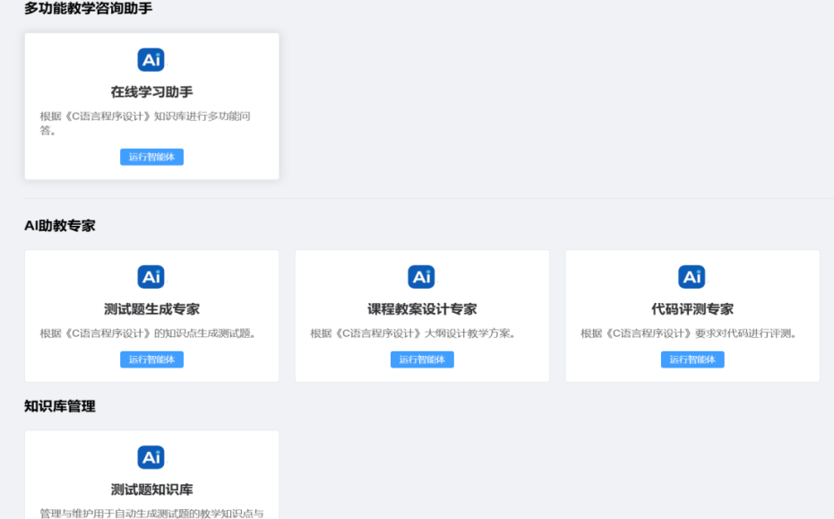
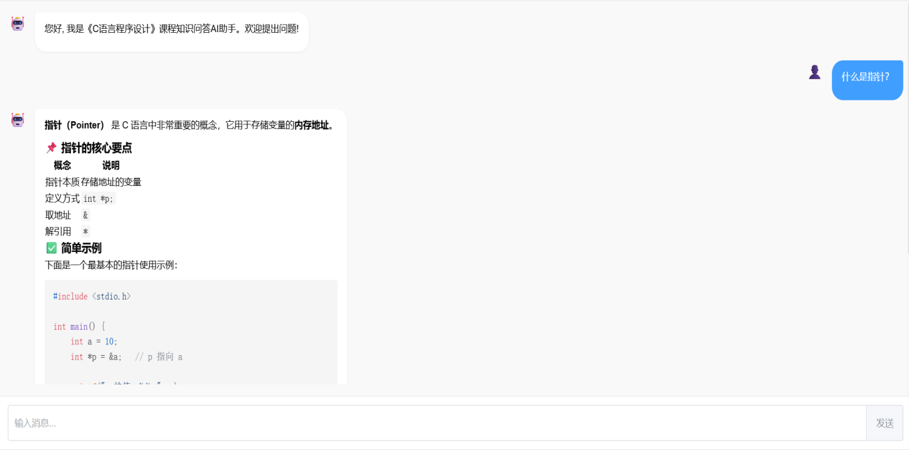
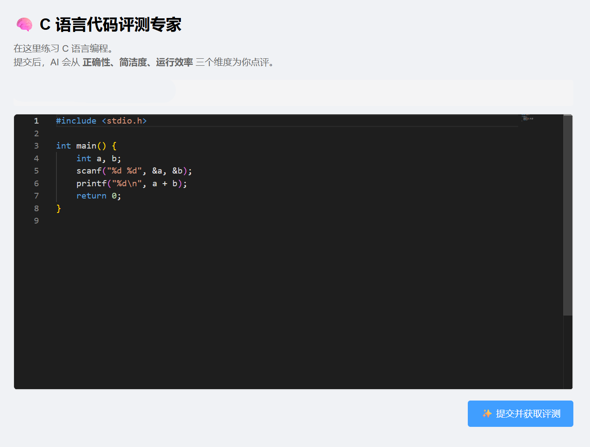
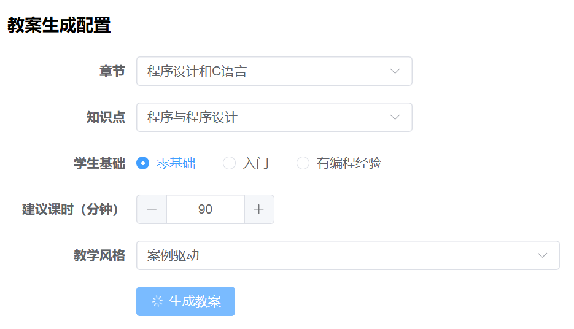

🎓 AI Teaching Agent: 基于LangChain与知识图谱的C语言教学智能体

项目简介：本项目是本科毕业设计成果，旨在通过结合LangChain框架与知识图谱技术，解决传统在线教育平台在知识问答、题目批改及个性化学习方面的不足。项目构建了一个集“教、学、练、评”于一体的AI教学智能体，实现了知识问答、测试题生成、教案设计及代码评测等核心功能。
  

✨ 核心功能

本项目通过多智能体协同（Multi-Agent）机制，提供了以下四大核心教学辅助功能：

1. 💬 知识问答 (Knowledge QA)

• 上下文记忆：基于LangChain的Memory机制，保存多轮对话历史，支持连贯的咨询体验。

• 双路增强检索：融合RAG（检索增强生成）与KG（知识图谱），不仅进行语义向量检索，还通过知识图谱进行多跳推理，显著提升回答的准确性和可解释性。

• 流式输出：前端支持答案的实时流式输出，提升交互体验。

2. 📝 测试题生成 (Test Generation)

• 个性化出题：支持用户根据知识点、题型（选择/判断/编程）、难度等级自定义生成测试题。

• 灵活输出：支持一键导出为文档、保存至个人题库或直接进入在线考试模式。

• RAG/KG开关：用户可自由选择是否启用知识图谱和向量检索辅助生成，确保题目紧扣教材且不超纲。

3. 📚 教案设计 (Lesson Planning)

• 结构化生成：输入章节、用户基础、课时等信息，自动生成包含教学目标、重难点分析、教学步骤及课后作业的结构化教案。

• 风格定制：支持不同教学风格的配置，满足多样化的教学需求。

4. 💻 代码评测 (Code Review)

• 多维度评价：针对C语言代码，从语法正确性、代码简洁度、运行效率三个维度进行自动化评测。

• 温和指导：以助教视角提供改进建议，而非单纯判题，注重教学引导。

# 部分图片示例





🛠️ 技术架构

本项目采用前后端分离架构，结合本地化大模型部署，确保数据安全与响应速度。

后端技术栈

• 框架：Django 4+ (Python)

• AI编排：LangChain

• 大模型：Qwen3:1.7b (通过 Ollama 本地私有化部署)

• 数据库：

  • MySQL：存储用户信息与业务数据

  • Neo4j：存储C语言知识图谱（结构化知识）

  • Chroma：存储教学文档向量（非结构化知识）

前端技术栈

• 框架：Vue 3 + Vite

• UI组件库：Element Plus

• HTTP客户端：Axios


🚀 快速开始

环境依赖

• Python 3.13+

• Node.js 16+

• MySQL

• Neo4j

• Ollama (用于本地部署Qwen3)

# 后端部署

# 1. 克隆仓库
git clone https://github.com/your-username/AI-LMS-Teach.git

cd ai-teaching-agent/ai_ims_backend

# 2. 配置数据库
修改 backend/settings.py 中的 DATABASES 配置

# 3. 启动Django服务
python manage.py runserver


# 前端部署

# 1. 进入前端目录
cd ../ai-web

# 2. 安装依赖
npm install

# 3. 启动服务
npm run dev


# 知识图谱构建

• 将《C语言程序设计》教材文本放入指定目录。

• 运行脚本，利用大模型辅助生成三元组，并导入Neo4j数据库。


📂 项目结构说明
```text
.
├── ai_ims_backend/         # Django后端项目
│   ├── authentication/     # 用户认证模块
│   ├── chat/               # 知识问答模块
│   ├── experts/            # 多功能专家智能体
│   │   ├── agents/         # 各智能体实现
│   │   ├── prompts/        # 提示词工程
│   │   └── schemas/        # 输出结构约束
│   ├── rag_service/        # RAG+KG核心推理服务
│   ├── utils/              # 通用工具类
│   └── core/               # 核心配置
├── Ai-Web/                 # Vue3前端项目
│   ├── src/views/          # 页面组件
│   └── src/components/     # 公共组件
├── docs/                   # 文档与图片资源
└── README.md
```

运行图片：


🙏 致谢

• 指导教师：邓成剑 (华南农业大学)

• 数据来源：《C语言程序设计》教材

• 开源框架：LangChain, Django, Vue.js
